# iOS9-Swift-2-Instagram-Clone

Swift 2 and Parse BaaS application that allow users to 

1. Login
2. Signup
3. Follow/unfollow users
4. Upload images from phone 
5. See the images uploaded by users that he is following

## Pre-requisites

1. XCode 7 with Swift 2 and iOS 9

## Setup

1. Clone the project from GitHub `https://github.com/anilallewar/iOS9-Swift-2-Instagram-Clone`
2. Open `Instagram-Clone-Swift.xcodeproj` in XCode.
3. Create a new project in [Parse](https://www.parse.com/) and note the application ID and client key for your application. Use the Parse [Quickstart](https://www.parse.com/apps/quickstart) to get started quickly. 
3. Open the `ParseStarterProject/AppDelegate.swift` file and make changes for Parse application ID and client key.
```
        //Uncomment and fill in with your Parse credentials:
        Parse.setApplicationId("AQ5XiDRS2iz3zZnz30j3JkuDyL6L0kpRcNoRRPGU",
            clientKey: "rPYnyoNPJ4iu8nfoPFTBcPdyEC4Rx8W6lxyPfcVs")
```
4. Build and run the application on the XCode simulator to signup, create new user, login and enjoy the app!

## Screenshots
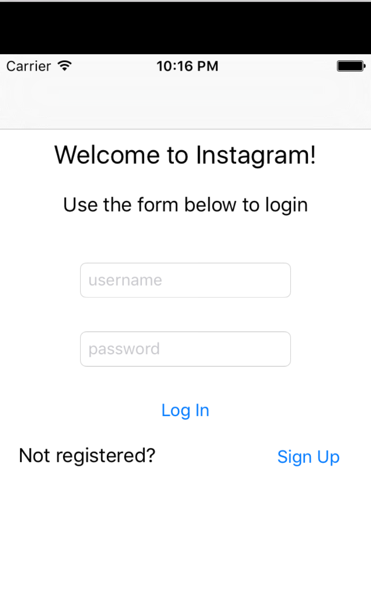 &nbsp;&nbsp;&nbsp;&nbsp;
 &nbsp;&nbsp;&nbsp;&nbsp;
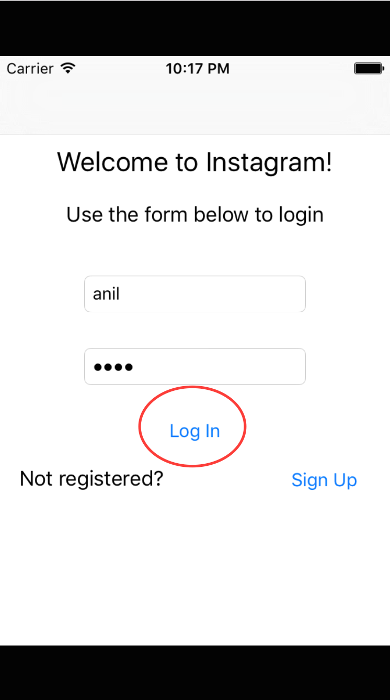
<br/>
<br/>
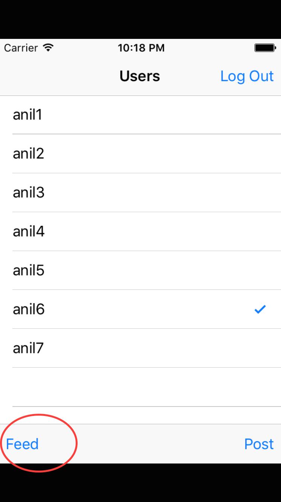 &nbsp;&nbsp;&nbsp;&nbsp;
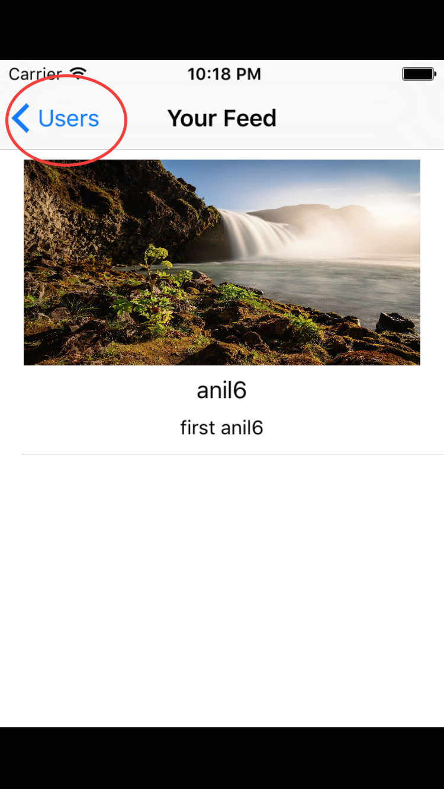 &nbsp;&nbsp;&nbsp;&nbsp;
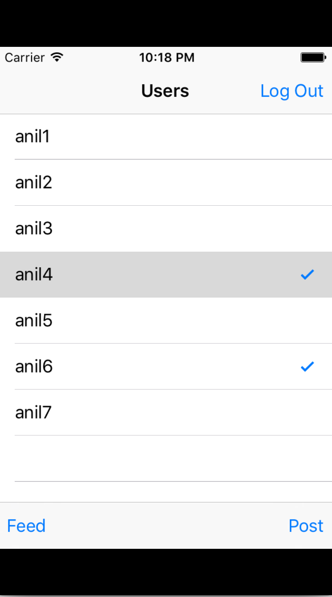
<br/>
<br/>
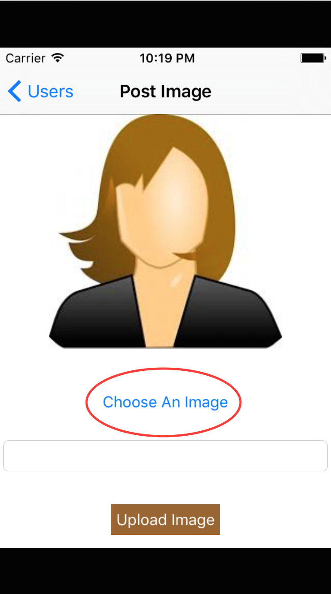 &nbsp;&nbsp;&nbsp;&nbsp;
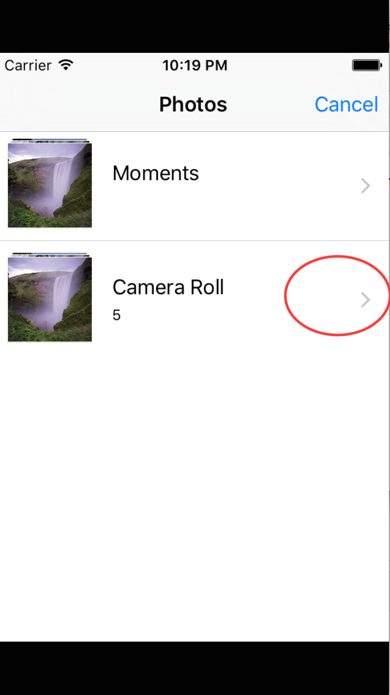 &nbsp;&nbsp;&nbsp;&nbsp;
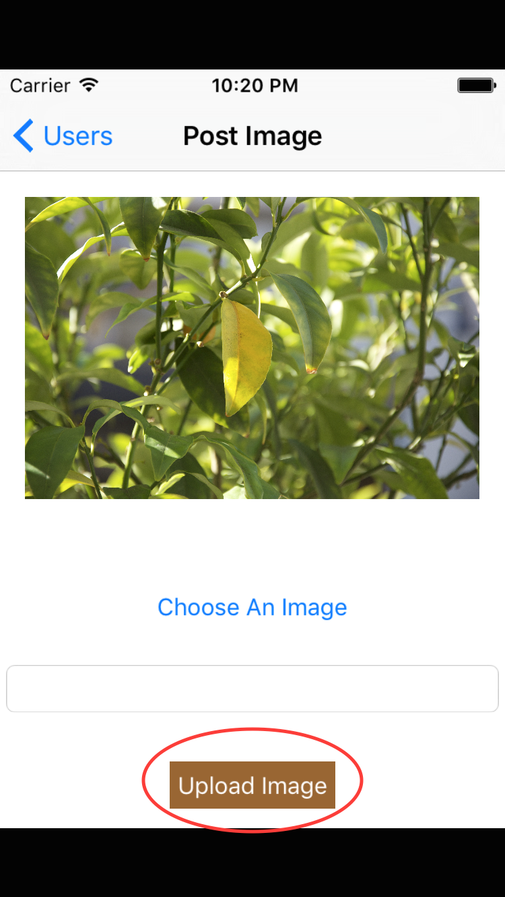
<br/>
<br/>
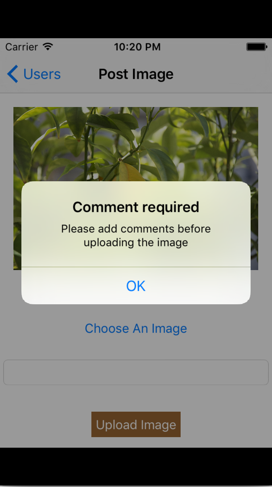 &nbsp;&nbsp;&nbsp;&nbsp;
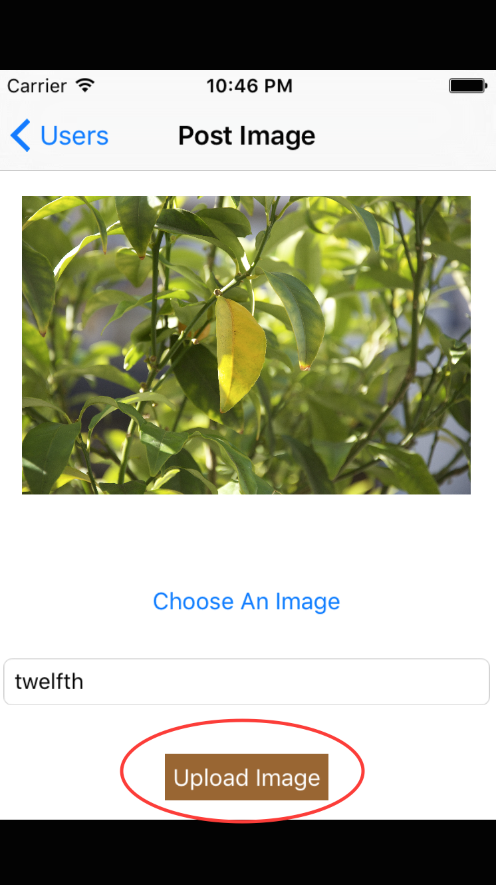 &nbsp;&nbsp;&nbsp;&nbsp;
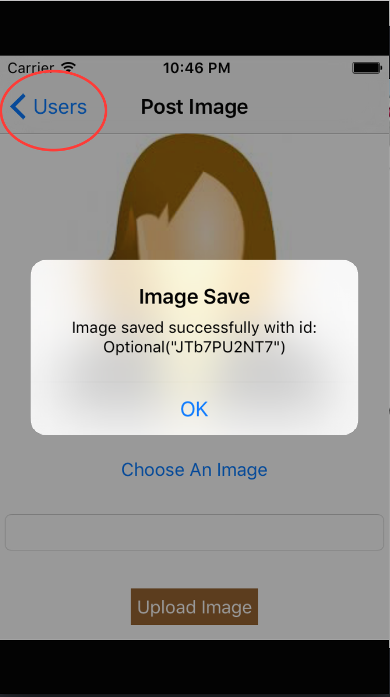
<br/>
<br/>
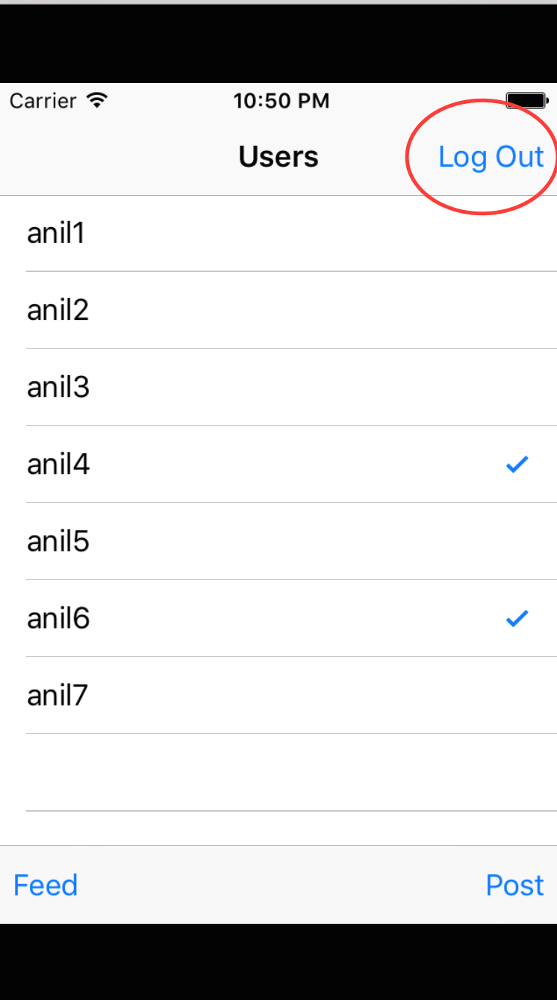 &nbsp;&nbsp;&nbsp;&nbsp;
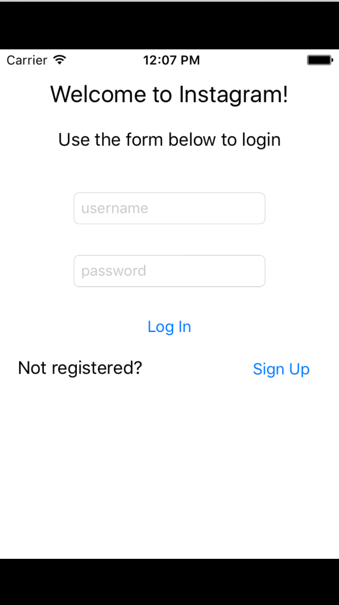 &nbsp;&nbsp;&nbsp;&nbsp;
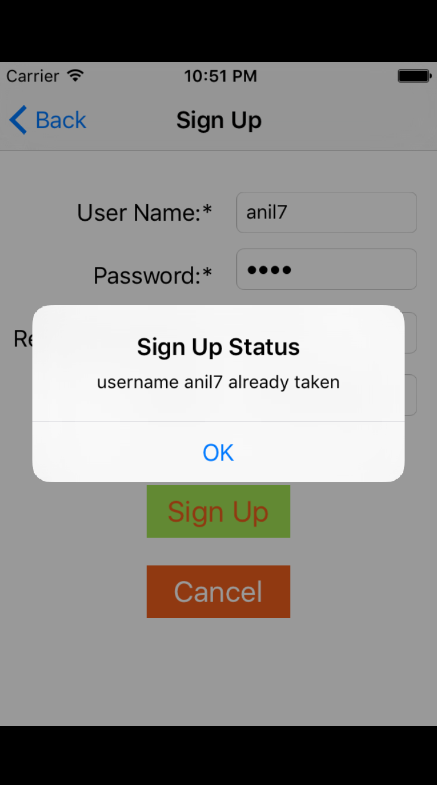
<br/>
<br/>
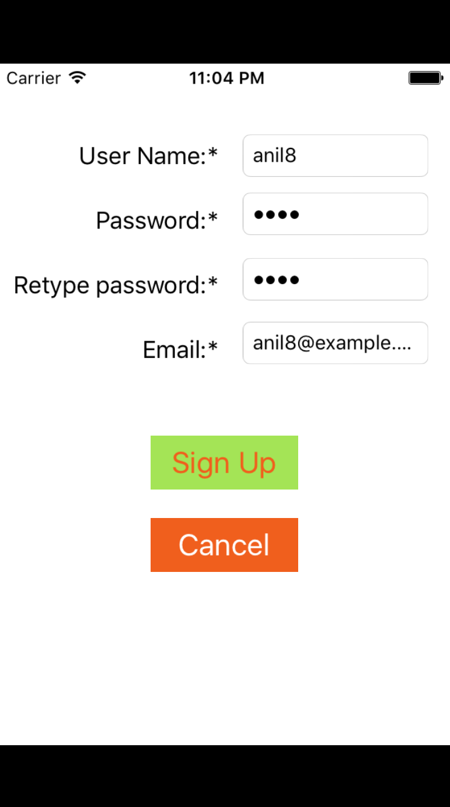
